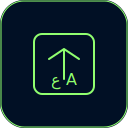

<div align="center">
   
# ⌨️ Correct It

> 🔄 Fix your keyboard layout mistakes instantly!

[](https://opensource.org/licenses/MIT)




*Never worry about wrong keyboard layouts again!*

</div>

---

## ✨ Features

🚀 **Instant Fixes**
- Transform wrongly typed text with a double-press
- Smart detection of keyboard layout mistakes
- Works with any text input field

⌨️ **Multiple Layouts**
- Windows Arabic keyboard
- Mac Arabic keyboard (Standard)
- Mac Arabic 102-key layout
- Mac Arabic 87-key layout

⚡ **Quick Actions**
- Double Shift (default) or Command shortcut
- F4/F9 undo options
- Customizable shortcuts

🎨 **Modern Interface**
- Sleek dark mode settings
- Easy-to-use configuration
- Clean and intuitive design

## 🛠️ Installation

```bash
# Clone this repository
git clone https://github.com/iamB0ody/correct-it.git

# Navigate to chrome://extensions
# Enable Developer Mode
# Click "Load unpacked"
# Select the extension directory
```

## 📖 Usage Examples

| Scenario | Wrong Input | Corrected Output |
|----------|-------------|------------------|
| English layout on Arabic keyboard | sghhj | مرحبا |
| Arabic layout on English keyboard | ىثممخ | hello |

## ⚙️ Configuration

<details>
<summary>Available Settings</summary>

### Keyboard Layouts
- `Arabic - Windows (PC)`
- `Arabic - Mac`
- `Arabic - Mac (102 keys)`
- `Arabic - Mac (87 keys)`

### Shortcuts
- `Double Shift` (Default)
- `Double Command/Meta Key (⌘)`

### Undo Options
- `F4` (Default)
- `F9`

</details>

## 🔧 Development

```bash
# Clone repository
git clone https://github.com/iamB0ody/correct-it.git

# Load in Chrome
1. Open chrome://extensions
2. Enable Developer Mode
3. Load unpacked extension
```

## 📁 Project Structure

```
correct-it/
├── manifest.json      # Extension manifest
├── content.js         # Core functionality
├── settings.html      # Settings UI
├── settings.js        # Settings logic
└── assets/
    └── icons/        # Extension icons
```

## 🤝 Contributing

Contributions are welcome! Feel free to:
- 🐛 Report bugs
- �� Suggest features
- 🔧 Submit pull requests

## 📝 License

MIT © [Abdulrahman Elheyb](https://github.com/iamB0ody)

---

<div align="center">
   
### Made with ❤️ for the Arabic typing community

*If this extension helps you, consider giving it a ⭐*

</div> 